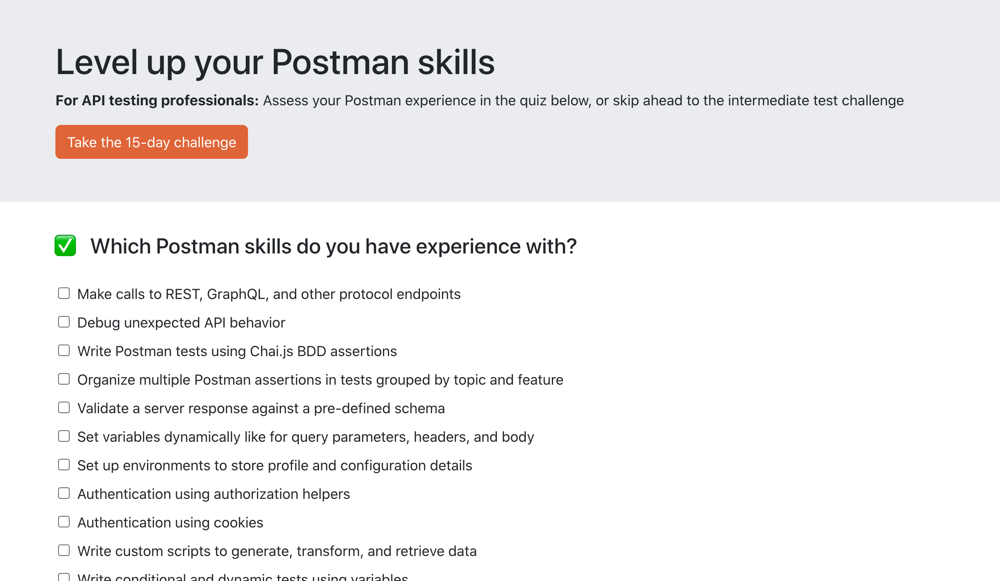

## Postman skills for API test professionals

**For API testing professionals:** Assess your Postman experience in [this quiz](https://loopdelicious.github.io/postman-skills/).

Install dependencies and run the app in the development mode.

    $ npm install
    $ npm start

Publish to production at `https://loopdelicious.github.io/postman-skills/` (from `gh-pages` branch).

    $ npm run deploy
